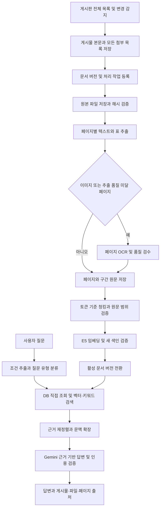

# 건강기능식품심의위원회 전체 게시물·첨부파일 RAG 개선 계획서

작성일: 2026-09-10  
상태: 코드 조사에 근거한 설계 초안 / 구현 및 운영 데이터 변경 전

## 1. 목표와 핵심 결정

건강기능식품심의위원회 게시물의 본문과 모든 PDF 첨부파일을 수집하고, 전체 페이지의 텍스트를 보존·청킹·임베딩하여 DB에서 검색할 수 있게 한다. 사용자는 Gemini 기반 질의응답으로 심의 결과, 보완 사유, 검토 조건과 회차별 변화를 찾고, 답변의 근거가 된 게시물·파일·페이지를 직접 확인할 수 있어야 한다.

현재 코드에는 PDF 추출과 PDF 청크 생성 경로가 이미 존재한다. 문제의 중심은 **첨부파일 전체 범위, 추출 완전성, 누락 재처리, 갱신 전파를 보장하지 못하는 구조**다. 기존 PostgreSQL/pgvector, E5 임베딩, Gemini 답변 생성을 활용하고 수집부터 출처 인용까지 연결을 보강한다.

- 전체 원문은 수집 시점에 DB화하고, 질문 시점에는 질문과 관련된 근거를 검색하여 Gemini에 전달한다.
- 모델 변경보다 누락 없는 원문 확보와 검색 품질 검증을 우선한다.
- 본문과 PDF를 필수 범위로 한다. HWP/HWPX도 첨부 목록에 전수 등록하고 미지원 여부를 공개한다. HWP만 있는 게시물을 포함한 모든 첨부 내용까지 완성하려면 변환·추출 지원을 별도 완료해야 한다.
- 처리 실패·이미지 페이지·미지원 파일을 완료로 숨기지 않는다. 검색 가능한 범위와 미처리 범위를 함께 보여준다.

이번 조사에서는 저장소 코드와 스키마, 기존 운영 문서를 확인했다. 운영 DB 집계, 운영 사이트·Gemini·E5 호출, 실제 첨부 PDF 표본 추출은 수행하지 않았다. 따라서 PDF 누락 건수, 실제 배포 버전과 모델 가용성, 처리 비용·시간은 아직 확정하지 않는다.

## 2. 현재 연결 구조

| 구간 | 현재 구현 | 근거 파일 |
|---|---|---|
| 게시물 동기화 | 목록·상세 페이지 수집, 회의 및 안건 저장, PDF 텍스트 추출·백필 | `app/api/committee/sync/route.js` |
| PDF 처리 | 링크 추출, 다운로드, PDF 매직바이트 확인, `pdf-parse` 텍스트 추출 | `lib/committeePdf.js` |
| 별도 재수집 | 본문/PDF 누락 보충, 별도의 PDF 추출 로직 | `app/api/committee/rebuild/route.js` |
| 청킹·저장 | `agenda`, `body`, `pdf` 청크 생성 및 임베딩 저장 | `app/api/committee/chunks/route.js`, `lib/committeeChunks.js` |
| 임베딩 | E5 API 호출, 384차원 벡터, 최대 16개 배치, 해시 재사용 | `lib/e5.js`, `services/e5-embedding/lib/model.js` |
| 질의응답 | 직접 DB 조회 + 벡터/문자열 검색 + 조건부 근거 검증 + 답변 스트리밍 | `app/api/committee/chat/route.js` |
| Gemini | 질문 분석·근거 검증·답변 생성, 환경변수 기반 모델 선택 및 대체 모델 | `lib/gemini.js`, `lib/committeePrompt.js` |
| 관리·평가 | 청킹/전체 재구축/임베딩 재처리, AI 로그, Y/N 피드백 | `app/manage/page.js`, `app/api/committee/ai-admin/route.js`, `app/api/committee/feedback/route.js` |
| 저장 구조 | 회의별 본문/PDF 텍스트, 청크 JSON 벡터 및 pgvector 필드 | `prisma/schema.prisma` |

현재 코드의 임베딩 식별자는 `Xenova/multilingual-e5-small-int8`이며, E5 서비스가 로드하는 모델은 `Xenova/multilingual-e5-small`이다. Gemini가 임베딩을 담당하는 구조가 아니다. Gemini 모델의 기본 문자열은 `lib/gemini.js`에서 확인되지만 실제 배포 환경의 선택값과 호출 성공 여부는 별도 확인해야 한다.

`docs/committee-rag-v2.md`에는 Gemini 768차원 임베딩 설명이 남아 있어 현재 E5 384차원 코드와 다르다. `docs/e5-deployment-and-backup.md` 및 실제 적용 스키마를 함께 확인해야 한다.

## 3. 확인한 문제와 영향

| 우선순위 | 코드에서 확인한 내용 | 사용자에게 미치는 영향 |
|---|---|---|
| P0 | 청크 API의 `missing` 대상이 `chunks: { none: {} }` | 본문/안건 청크가 하나라도 있으면 PDF 청크 누락을 복구하지 못함 |
| P0 | `rebuild` 경로에서 PDF 추출 `max: 10`, 저장 `substring(0, 6000)` | 11페이지 이후 또는 6,000자 이후의 근거가 저장되지 않을 수 있음 |
| P0 | 이미 `pdfContent`가 있으면 청크 API에서 PDF를 다시 추출하지 않음 | 잘린 텍스트가 저장된 회의는 전체 청크 재구축만으로 복구되지 않음 |
| P0 | 청킹 함수가 중첩을 붙인 뒤 `.slice(0, maxSize)` 처리 | 원문 끝부분이 청크에서 유실될 수 있음 |
| P0 | 회의당 `pdfFileUrl`/`pdfContent` 한 쌍, 링크 추출도 첫 PDF만 반환 | 복수 PDF를 개별 추적·처리할 수 없음 |
| P1 | 기본 PDF 추출은 텍스트 파싱만 수행, 실패 시 `null` 반환 | 스캔 PDF와 일부 이미지 페이지의 내용이 검색되지 않음 |
| P1 | `rebuild`의 `missing`/`pdf` 모드가 PDF 텍스트 실패보다 URL 유무를 기준으로 대상 선정 | URL이 있지만 추출 실패한 회의가 재처리에서 제외될 수 있음 |
| P1 | `NONE` 문자열을 PDF 없음 마커로 사용, 일부 통계는 단순 `not: null` 집계 | 실제 PDF 보유 수와 처리율을 오인할 수 있음 |
| P1 | 본문 저장에 8,000자 제한, 상세 HTML 전체를 텍스트화 | 긴 본문 누락과 메뉴·푸터 등 검색 잡음 가능 |
| P1 | 동기화와 청킹이 별도 동작이며 원문 수정 시 청크 갱신 작업을 등록하지 않음 | 새 PDF 텍스트가 있어도 검색 색인은 과거 상태일 수 있음 |
| P1 | 기존 본문/PDF가 있으면 상세 재조회·재추출을 생략하는 조건 존재 | 동일 URL 파일 교체, 본문 수정, 기존 부분 추출을 놓칠 수 있음 |
| P1 | 관리자 청킹 작업이 브라우저에서 API 반복 호출 | 탭 종료·통신 오류 후 작업 진행과 재개를 서버가 보장하기 어려움 |
| P1 | PDF의 파일 식별자·페이지·문단 위치가 청크에 없음 | 답변을 뒷받침하는 정확한 PDF 페이지 인용 불가 |
| P1 | 답변 참조 데이터가 안건 중심으로 만들어짐 | PDF/body 청크만 검색된 답변에서 근거 카드가 충분히 표시되지 않을 수 있음 |
| P1 | 수집 UI 45페이지 요청, API 최대 50페이지 제한 | 원본 게시판 전체가 수집되었음을 보장하지 못함 |
| P2 | 벡터 검색은 `embeddingVector IS NOT NULL`, 문자열 검색은 최근 ID 100개 중심 | 모델/색인 버전 필터 부족, 오래된 정확한 근거 후보 누락 가능 |
| P2 | 최종 청크 8개 중심 검색과 직접 조회별 개수 제한 | “전체 안건”, “해당 기간 모두”, 건수 집계를 일반 검색만으로 완성하기 어려움 |
| P2 | 혼합 검색 점수를 고정 임계값과 비교, 일부 경우만 근거 검증 | 검색 점수를 답변 신뢰 확률처럼 해석하기 어려움 |

### 청킹 유실 재현

기존 `splitIntoSemanticChunks`를 수정 없이 Node에서 실행했다. 입력은 600자 문단과 끝에 `TAILMARKER`가 있는 600자 문단을 빈 줄로 연결한 1,202자 문자열이었다. 출력은 600자 청크 2개였지만 어떤 청크에도 마지막 `TAILMARKER`가 없었다. 이는 코드 수준에서 재현한 원문 유실이며, 운영 문서에서의 발생 빈도는 아직 조사하지 않았다.

현재 `mode: all`은 기존 청크를 트랜잭션에서 삭제하고 신규 행으로 교체한다. 신규 임베딩이 일부 실패하더라도 교체가 진행될 수 있으므로 운영 복구는 새 색인을 검증한 후 전환하는 방식으로 바꿔야 한다.

## 4. 구현 전 데이터 진단

최초 실행 결과를 `docs/committee-rag-baseline.md`와 기계 판독 가능한 집계 파일로 남긴다. 이 산출물은 후속 구현 단계의 작업이며 이번 계획서 작성에서는 생성하지 않았다.

1. 실제 DB의 벡터 확장·차원·트리거·인덱스와 적용 마이그레이션을 조회한다. E5 384차원 스키마와 코드의 일치를 확인한다.
2. 회의 전체 수, 유효 PDF URL 수(`NULL`, 빈 문자열, `NONE` 제외), 유효 PDF 텍스트 수, PDF 청크 보유 수, PDF 임베딩 완료 수를 분리 집계한다.
3. PDF URL은 있지만 텍스트 없음 / 텍스트는 있지만 PDF 청크 없음 / PDF 청크는 있지만 정상 벡터 없음 / 원문보다 오래된 색인을 목록화한다.
4. 6,000자 PDF 텍스트와 8,000자 본문은 절단 의심군으로 표시한다. 길이만으로 절단 확정하지 않고 원문과 대조한다.
5. 원본 목록의 마지막 페이지·고유 게시물 ID 집합과 DB를 대조한다. 빈 목록이 정상 종료인지 HTML 변경·접속 실패인지 구분한다.
6. 복수 PDF, 10페이지 초과 PDF, 텍스트 PDF, 스캔 PDF, 텍스트/이미지 혼합 PDF, 표 중심 PDF, 다운로드 실패, HWP만 있는 게시물에서 표본을 확보한다.
7. 기존 질문·피드백에서 대표 질문을 선정하고 답변, 검색 청크, 정답 페이지, 소요시간을 기준선으로 기록한다.

집계는 존재 여부뿐 아니라 공백 텍스트, 정상 차원·유한값 벡터, 적용 모델과 실제 검색 가능 여부까지 확인한다. 원문 추출기 버전이 없는 과거 PDF 텍스트는 완전성을 입증하기 어려우므로 V3 백필에서 원본을 다시 확인한다.

## 5. 목표 처리 구조

### 5.1 전수 수집과 변경 감지

- 고정 페이지 수 대신 정상 마지막 페이지까지 탐색하고 고유 `seq`로 중복을 제거한다. 안전한 실행 시간 상한에 도달하면 실패나 완료로 처리하지 않고 다음 커서를 저장한다.
- 초기 전수 수집, 이후 신규 게시물 확인, 기존 게시물 정기 재확인을 분리한다. 주기는 실제 게시 빈도와 원본 서버 부담을 확인해 설정한다.
- 본문 영역만 추출하고 원본 HTML과 정제 텍스트를 보존한다. 저장 길이 제한을 제거하고 표시용 발췌문만 별도로 만든다.
- 첨부파일마다 원본 식별자, URL, 표시명, 파일 형식과 발견 순서를 저장한다. 확장자 외에 응답과 실제 파일 형식도 확인한다.
- 같은 URL이라도 바이트 해시가 바뀌면 새 문서 버전을 생성한다. HTTP 변경 검사는 보조 정보로 사용한다.
- 삭제·교체는 정상 상세 조회 결과로 확인한다. 일시적인 404·접속 실패·파서 오류만으로 기존 검색 자료를 지우지 않는다.

### 5.2 전체 PDF 추출 및 OCR

- `committeePdf`와 `rebuild`의 중복 추출 구현을 하나의 서비스로 통합한다.
- 원본 PDF를 해시 기준 저장소에 보관하고 DB에는 저장 위치·용량·MIME·다운로드 시각을 기록한다. 본문·페이지 텍스트·청크·메타데이터·벡터는 DB에 저장한다.
- PDF 전체 페이지 수와 페이지별 텍스트·추출 방법·품질 상태를 저장한다. 문서 전체에 글자가 있다는 이유로 이미지 페이지를 건너뛰지 않는다.
- 텍스트 밀도, 깨진 문자 비율, 페이지 이미지 구성 등으로 OCR 대상을 선정한다. 글자 수 하나만으로 성공/실패를 결정하지 않는다.
- 표는 열 제목, 원료명, 결과, 비고의 대응을 보존한다. 여러 페이지에 걸친 표의 반복 헤더를 처리하고 해당 행의 페이지 위치를 유지한다.
- OCR/레이아웃 도구는 확보한 한국어·표·혼합 PDF 표본에서 정확도와 비용을 비교한 뒤 선택한다. 특정 외부 서비스 도입은 이 계획에서 확정하지 않는다.
- 다운로드 실패, 암호화, 손상, 텍스트 없음, OCR 필요, OCR 검수 필요를 구별한다. 실패 원인과 재시도 시각을 저장한다.
- 비정상 파일의 과도한 자원 사용을 막기 위해 다운로드 바이트·페이지 수·처리시간 한도를 두되, 초과 문서는 별도 대용량 작업 대상으로 남긴다. 원문을 잘라 완료 처리하지 않는다.

### 5.3 청킹과 임베딩

- 먼저 원문 유실 버그를 수정하고 새 `chunkVersion`을 부여한다. 중첩 분량까지 포함한 예산으로 나누며 넘치는 내용은 다음 청크로 넘긴다.
- E5 tokenizer로 실제 토큰 수를 측정한다. 초기 실험값은 본문 250~350토큰, 중첩 40~60토큰이며, 접두사·제목·특수 토큰을 포함한 입력 상한을 검증한 뒤 확정한다.
- E5 원본 모델 문서는 긴 텍스트가 최대 512토큰으로 잘린다고 명시한다. 따라서 600자 제한만으로 완전한 임베딩을 보장하지 않고, 배포된 Xenova revision의 tokenizer 설정을 실제로 확인한다. [E5 모델 문서](https://huggingface.co/intfloat/multilingual-e5-small)
- 문단·안건·표 행을 우선 경계로 삼고, 긴 안건도 분할한다. 작은 검색 청크와 큰 문맥 구간을 연결하여 검색 후 필요한 주변 내용을 확장한다.
- 청크마다 문서 버전, 파일, 페이지 범위, 페이지 내 문자 범위 또는 구간 매핑, 제목 경로, 순서를 저장한다. PDF 페이지 번호는 파일 내 1부터 시작하는 실제 페이지를 기준으로 한다.
- 정규화 원문의 내용 구간이 청크들의 합집합으로 모두 덮이는지 검증한다. 제외한 반복 머리말 등은 제거 규칙을 기록한다.
- 임베딩 캐시 키에 실제 임베딩 입력 해시, 모델 revision, 차원, 전처리 버전, 문서/질문 구분을 포함한다. 내용이 같아도 출처 레코드는 각각 유지한다.
- 요청별 응답 수·차원·유한값·정규화를 검사하고 실패를 해당 배치·청크에 정확히 매핑한다.

## 6. 데이터 모델 변경안

실제 이름과 필드 타입은 마이그레이션 구현 단계에서 확정한다. 아래 구조는 설계안이다.

| 엔터티 | 주요 필드 | 역할 |
|---|---|---|
| 기존 `committee_meetings` | `seq`, 회차, 등록일, 회의일, `sourceUrl`, 마지막 정상 확인 시각 | 게시물 기준점. 기존 조회 화면과 호환 유지 |
| 신규 `committee_documents` | `meetingId`, `sourceType`, `sourceKey`, 파일명, 원본 URL, 활성 버전, 삭제 확인 상태 | 본문 1개와 모든 첨부파일을 독립 문서로 관리 |
| 신규 `committee_document_versions` | `documentId`, 원본/텍스트 해시, 저장 위치, 추출기 버전, 페이지 수, 상태, 생성 시각 | 파일 교체와 재추출 이력, 활성/준비/이전 버전 관리 |
| 신규 `committee_document_pages` | `versionId`, `pageNumber`, 텍스트, 표·구간 정보, OCR 여부, 품질, 오류 | 페이지 원문 및 정확한 인용 위치 |
| 확장 `committee_chunks` | `documentVersionId`, 구간 매핑, `pageStart/End`, `parentSectionId`, 토큰 수, 색인 버전 | 검색 근거와 원문 사이 연결 |
| 신규 `committee_ingestion_jobs` | 대상 버전, 단계, 멱등 키, 상태, 시도 횟수, `nextRetryAt`, `leaseUntil`, 오류, 진행량 | 서버에서 지속되는 처리·재개·재시도 |
| 확장 안건·피드백 | 안건의 원문 근거 ID와 검수 상태, 답변의 문서 버전·페이지·검색 설정 | 구조화 조회의 근거 보장과 평가 재현 |

고유 제약은 문서 `(meetingId, sourceKey)`, 페이지 `(versionId, pageNumber)`, 청크 `(documentVersionId, chunkVersion, orderIndex)`, 작업의 멱등 키에 둔다. 문서 버전의 중복 기준에는 원본 해시와 추출 파이프라인 버전을 포함한다. 동일 파일을 다시 추출할 때도 품질 개선 이력을 구별해야 한다.

활성 문서 버전과 준비 중 버전을 분리하고 정상 완료된 활성 버전의 벡터만 일반 검색에 사용한다. 검색에서는 모델/revision·차원·청크 버전·임베딩 완료 상태를 명시적으로 제한한다. 모델이나 차원이 달라지는 실험은 별도 색인으로 비교한다.

기존 `pdfFileUrl`/`pdfContent` 필드는 전환 기간 호환용으로 유지하되 새 문서 테이블을 기준 데이터로 삼는다. 마이그레이션 초기에 기존 값을 과거 버전으로 연결하고 첨부 목록 재탐색으로 나머지 파일을 채운다.

## 7. 작업 실행과 재처리

API는 작업 등록·상태 조회·재시도 요청을 담당하고, PDF/OCR/임베딩은 지속 실행 가능한 별도 worker가 처리한다. 초기에는 PostgreSQL 작업 테이블과 worker 한 개를 제안한다. 배포 환경의 실행 방식과 OCR 도구가 확정된 뒤 worker 호스팅을 정한다.

- 단계: 발견 → 다운로드 → 추출 → 필요 페이지 OCR → 품질 확인 → 청킹 → 임베딩 → 검증 → 활성화.
- 실패한 단계부터 재개하고 이미 완료된 원본 다운로드·OCR·임베딩은 재사용한다.
- worker는 작업을 원자적으로 선점하고 임대 만료 후 재처리를 허용한다. 동시 실행과 재시도에서도 고유 제약과 멱등 키로 중복 생성을 방지한다.
- 429·일시 오류에는 제한된 지수 백오프와 재시도, 손상·암호화·미지원에는 명확한 검토 상태를 적용한다.
- 전체 수집 중 개별 파일이 실패하면 나머지는 진행하되 전체 실행은 `partial`로 표시한다.
- 브라우저를 닫아도 서버 작업은 계속되며, 관리 화면은 작업 ID로 진행 상황을 다시 조회한다.
- 새 문서 버전의 모든 필수 단계가 검증된 뒤 짧은 트랜잭션으로 활성 버전을 교체한다. 실패한 재구축이 기존 검색 가능 데이터를 덮어쓰지 않게 한다.

새 파일이 일부 페이지만 처리된 경우 기본적으로 완전 색인 완료로 공개하지 않는다. 필요한 경우 부분 자료를 별도 검색 경로로 제공하되, 답변에 미처리 페이지가 있음을 명시하고 완전한 목록·부재 판단에 사용하지 않는다.

## 8. 검색과 Gemini 답변 개선

### 8.1 질문에 맞는 검색 경로

| 질문 유형 | 처리 방식 |
|---|---|
| “제○차 심의 결과 전체” | 회차를 정확히 식별하고 해당 문서·안건을 완전히 조회. 개수 제한으로 일부만 잘라 전체라고 답하지 않음 |
| “이 원료의 보완 사유는?” | 원료명·동의어 검색 + 의미 검색 + 관련 PDF 구간 및 앞뒤 문맥 확보 |
| “최근 3년간 ○○ 결과를 모두” | 기간 필터 + 구조화 안건 조회. 추출·검수 범위와 누락 여부를 확인하고 필요 시 페이지네이션·내보내기 제공 |
| “○○ 원료가 몇 건인가?” | 검증된 구조화 데이터 집계. 유사 청크 개수를 안건 수로 사용하지 않음 |
| “이전 회의와 변경된 점” | 회차·날짜·문서 버전을 분리하여 근거를 각각 검색하고 비교 |
| “자료에 없는 조건” | 근거 부족 또는 자료 처리 중임을 알리고 확인 가능한 관련 자료 제시 |

기존 안건은 주로 게시물 텍스트 파싱으로 생성된다. PDF에만 존재하는 안건도 구간 근거를 가진 구조화 레코드로 추출하고 검수 상태를 둬야 한다. 전체 목록·통계는 이 구조화 자료의 완전성 검증 후 제공한다.

### 8.2 검색 품질

- 문서 범위와 회차·기간 조건을 먼저 정규화하고 벡터 검색과 키워드 검색에 동일하게 적용한다.
- 의미 검색과 한국어 원료명·제품코드의 정확 검색을 병행한다. 초기에는 PostgreSQL의 문자열/정규화 색인을 검토하고 한국어 표본으로 성능을 측정한다. BM25 도입은 별도 검색 엔진 또는 확장이 필요한 선택안으로 남긴다.
- 두 검색 후보를 점수 단순 합산 대신 순위 결합(RRF)으로 통합한 뒤 재정렬한다. 후보 40~80개, 최종 8~15개는 초기 실험 범위이며 최종 개수는 질문 유형과 근거 토큰 예산에 맞춘다.
- pgvector 문서는 전문 검색과의 결합, RRF 또는 cross-encoder를 통한 통합을 설명한다. 이 방식의 적합성은 프로젝트 평가셋으로 판단한다. [pgvector Hybrid Search](https://github.com/pgvector/pgvector#hybrid-search)
- 동일한 내용의 본문/PDF 중복이 문맥 예산을 소진하지 않도록 중복 제거하되 각각의 출처를 보존한다.
- 회차 요약은 해당 회의 전체 구간을 단계적으로 읽고 중간 요약의 근거 ID를 유지한다. 기간 전체·건수 질문은 일반 top-k 검색으로 대체하지 않는다.
- pgvector 장애 시 모든 JSON 벡터를 매 질문마다 읽는 동작을 기본 운영 경로에서 제거하고 제한된 키워드 검색과 서비스 상태를 제공한다.

### 8.3 답변과 출처

- 모든 검색 결과를 공통 근거 객체로 변환한다: `evidenceId`, 청크 ID, 문서 버전 ID, 게시물/파일명, 회차, 날짜, 페이지, 원문 발췌, 원본 링크.
- Gemini에는 이 근거와 질문을 전달하고 핵심 주장마다 근거 ID를 연결하게 한다. 파일명·페이지·URL은 서버가 실제 검색 메타데이터에서 구성한다.
- 답변 전에 근거 충족 여부를 판단하고, 생성 후에는 존재하지 않는 인용 ID와 주장-근거 불일치를 검증한다. 불일치 부분은 재생성하거나 근거 부족으로 표시한다.
- 검증 전 문장이 그대로 확정 답변이 되지 않도록 초기 버전은 답변 검증 후 공개를 우선한다. 스트리밍 유지 시에는 문단별 검증 후 공개 방식과 지연시간을 비교한다.
- 검색된 문서 내 명령문은 참고자료로만 취급하고 시스템 지시로 실행하지 않는다.
- 실제 PDF를 열 수 있는 출처 카드와 페이지 링크를 제공한다. 현재 회의 ID 기반 PDF 경로는 파일 ID 기반 조회를 지원하도록 확장한다.
- “검색 근거 없음”, “첨부파일 처리 실패/진행 중”, “자료가 서로 상충함”을 구별한다. 처리 누락 상태에서 “그런 사례는 없다”고 단정하지 않는다.
- 검색 점수는 정답 확률로 표시하지 않는다. 충분/부분/부족 상태와 이유, 검색 기준일을 제공한다.

## 9. 관리 화면과 완료 기준

관리 화면은 게시물 수 외에 첨부파일 수, 전체/처리 페이지 수, OCR 대기·검수 수, 추출 실패 수, 청킹 완료 수, 유효 벡터 수, 활성 색인 수, 갱신 대기 수를 표시한다. 게시물→파일→페이지→청크까지 내려가 누락 위치를 확인하고 해당 단계만 재처리할 수 있게 한다.

핵심 지표를 분리한다.

- **수집 목록 일치율:** 정상 확인한 원본 고유 게시물 중 DB에 등록한 비율.
- **첨부 파악률:** 정상 상세 조회한 게시물의 첨부 목록과 문서 레코드의 일치율.
- **PDF 검색 가능률:** 발견한 전체 PDF 중 모든 페이지 처리·검증과 활성 색인을 완료한 파일 비율. 미지원·실패를 분모에서 숨기지 않음.
- **페이지 처리율:** 확인한 PDF 전체 페이지 중 텍스트/OCR/확인된 빈 페이지 등 최종 상태가 결정된 비율.
- **임베딩 완료율:** 활성화 후보의 검색 대상 청크 중 해당 모델의 유효 벡터를 가진 비율.

최종 목표는 접근 가능한 전체 게시물 및 PDF의 검색 가능 상태다. 접근 불가·암호화·손상·미지원 때문에 남는 예외는 목록과 사유를 남기고 전체 100% 완료와 구분한다. 빈 페이지와 제외한 비내용 구간은 검증 기록으로 설명한다.

## 10. 단계별 작업과 산출물

| 단계 | 주요 작업 | 완료 판정 | 작업량 초안 |
|---|---|---|---|
| 0. 기준선 | DB 진단, 첨부 표본, 평가 질문 선정 | 누락 유형별 수량·정답 근거·현재 성능 확보 | 1~2일 |
| 1. 원문 보존 | 청킹 유실 수정, 중복 추출 통합, 전체 본문/PDF 보존, 파일·페이지 모델 | 긴 PDF·복수 PDF·기존 부분 텍스트 복구 표본 통과 | 3~5일 |
| 2. 처리 운영 | 작업 테이블, worker, 재시도, OCR·품질 검수, 버전 관리 | 탭 종료·worker 중단·재실행 후 정확히 재개 | 4~7일 |
| 3. 전수 백필 | 모든 게시물·첨부 재확인, 새 버전 추출·청킹·임베딩 | 전체 목록 대조와 검색 가능률 보고, 예외 목록 확정 | 구현 2~3일 + 실제 처리시간 |
| 4. 답변 품질 | 하이브리드 검색, 질문 유형 분기, PDF 안건 구조화, 페이지 인용 | 근거 기반 답변·전체 목록·통계·출처 검증 통과 | 4~6일 |
| 5. 검증·전환 | 평가셋, 구/신 비교, 관리 화면, 전환·복구 확인 | 품질 기준 충족 후 활성 색인 전환 | 2~3일 |

단일 구현자 기준 대략 16~26작업일의 초기 추정이며 확정 일정이 아니다. 실제 OCR 도구 연동 난이도, PDF 수·페이지 수, 원본 접근성, HWP 변환 범위와 호스팅 준비에 따라 조정한다. HWP/HWPX 전체 변환은 이 추정에 포함하지 않는다.

주요 수정 대상은 `lib/committeePdf.js`, `lib/committeeChunks.js`, `lib/e5.js`, `lib/committeePrompt.js`, `app/api/committee/{sync,rebuild,chunks,chat}` 및 PDF 조회 경로, `prisma/schema.prisma`, `app/manage/page.js`, `app/committee/page.js`다. 수집 작업·문서 추출·검색·근거 검증은 별도 라이브러리/worker로 분리하여 API 파일에 모두 추가하지 않는다.

Next.js 애플리케이션 코드 구현 전에는 저장소 `AGENTS.md`에 따라 설치된 `node_modules/next/dist/docs/`의 관련 가이드를 읽고 현재 버전 규칙을 적용한다.

## 11. 검증 항목과 초기 품질 목표

아래 숫자는 측정 결과가 아닌 출시 판단을 위한 제안값이다. 먼저 정답 문서·페이지가 검수된 질문 50~100개를 구성한다. PDF에만 있는 답, 긴 문서 뒤쪽, 스캔·표, 오래된 회차, 유사 원료명, 회차 비교, 전체 목록·집계, 답 없는 질문을 포함한다. 튜닝용과 최종 평가용 질문을 분리한다.

| 검증 | 초기 목표 |
|---|---|
| 추출 완전성 | 시험 문서의 11페이지 이후 및 6,000자 이후 원문까지 보존, 복수 첨부 모두 추적 |
| 청킹 보존성 | 정규화 후 검색 대상 원문 구간의 청크 커버리지 100%, 끝부분 유실 0 |
| 작업 안정성 | 같은 작업 반복·동시 실행에서 중복 청크 0, 중단 후 재개 가능 |
| 검색 | 답이 있는 평가 질문의 정답 근거 Recall@10 90% 이상 |
| 인용 정확성 | 핵심 주장에 연결된 인용 중 실제 해당 페이지가 뒷받침하는 비율 95% 이상 |
| 근거 부족 대응 | 답 없는 평가 질문의 근거 부족 응답 적합률 95% 이상 |
| 전체 목록·집계 | 검증된 평가 범위의 정답 목록/건수와 100% 일치, 제한된 조회를 전체로 표시하지 않음 |
| 변경 전파 | 본문 수정·동일 URL 파일 교체 후 신규 버전만 활성 검색, 과거 인용은 이력으로 조회 가능 |
| 장애 시 서비스 | OCR/E5 실패가 기존 활성 검색을 훼손하지 않고 실패 원인을 관리 화면에 표시 |

OCR 숫자·단위·인정/불인정 문구와 표의 열 대응은 별도 수동 검수한다. Gemini 자체 검증 결과만으로 정답 여부를 판정하지 않는다. 검색 지연, 답변 첫 표시/완료 시간의 p50/p95, 문서 처리량, 질문당 토큰 사용량을 측정하고 기준선과 비교한다. 구체적인 시간 목표는 운영 환경 측정 후 확정한다.

## 12. 안전한 전환과 비용 관리

1. 운영 DB와 원본 파일 저장소의 복구 가능한 백업을 확보하고 별도 검증 환경에서 마이그레이션을 확인한다.
2. 기존 테이블/필드를 즉시 제거하지 않고 새 문서·페이지·작업 구조를 추가한다.
3. 소수 표본으로 전체 경로를 검증한 뒤 체크포인트 기반 전수 백필을 수행한다.
4. 기존 활성 색인과 V3 준비 색인을 병행 유지하고 동일 질문의 검색·답변을 비교한다.
5. 완료된 버전만 활성화한다. 부분 전환 기간에는 미처리 범위를 표시하고 전체 통계·부재 판단을 제한한다.
6. 문제 발생 시 활성 버전/검색 설정을 이전 상태로 복구한다. 이전 원문·청크·인용 이력은 평가 종료 전 삭제하지 않는다.
7. 운영 문서를 현재 E5 구성과 새 처리 절차로 통일한다. 기존 `committee_rag_e5.sql`은 임베딩 초기화 구문을 포함하므로 일반 복구 절차로 재실행하지 않는다.

비용은 전체 PDF 페이지 수, OCR 대상 페이지 비율, 생성 청크 수, E5 처리시간, Gemini 질문·답변 토큰, 원본/색인 보관량을 기준으로 산정한다. 초기 실측 전 금액을 고정하지 않는다. 중복 파일·동일 입력 벡터 재사용, 변경 파일만 재처리, OCR 필요한 페이지만 처리, 검색 문맥 예산으로 비용을 관리한다.

## 13. 구현 착수 시 우선순위

첫 구현 묶음은 **현황 진단 → 원문 유실 수정 → 모든 첨부파일 및 페이지 모델 → 누락·변경 작업 등록**이다. 다음으로 worker/OCR와 전수 백필을 완성하고, 그 위에 검색·정확한 페이지 인용·답변 검증을 적용한다. 모델 교체 여부는 원문 완전성을 확보한 후 동일 평가셋으로 판단한다.

이 계획이 완료되면 “게시물에 파일 링크가 붙어 있다”는 상태를 넘어, 어떤 파일의 어떤 페이지가 검색 가능한지 확인하고 그 근거를 사용자 답변까지 추적할 수 있다.
